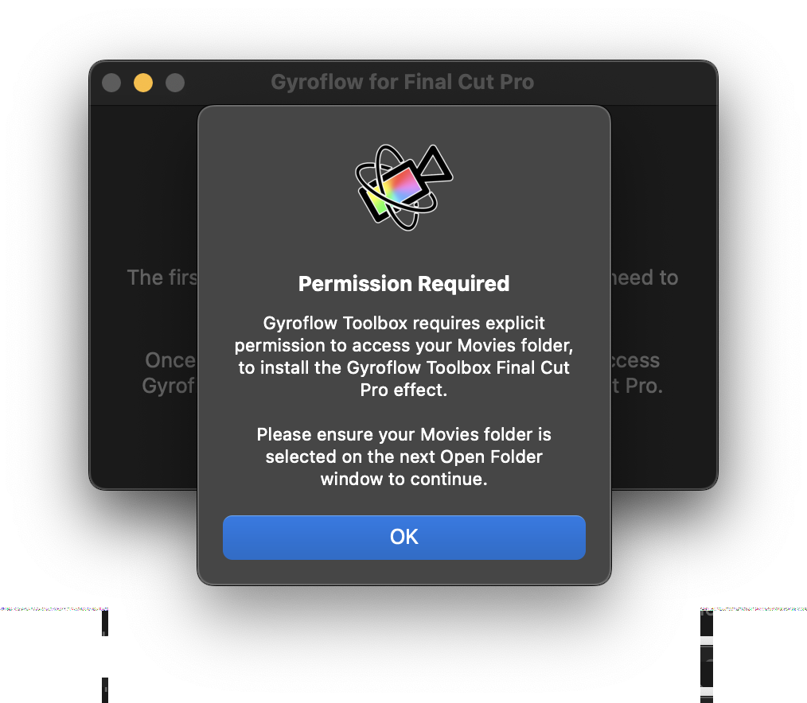
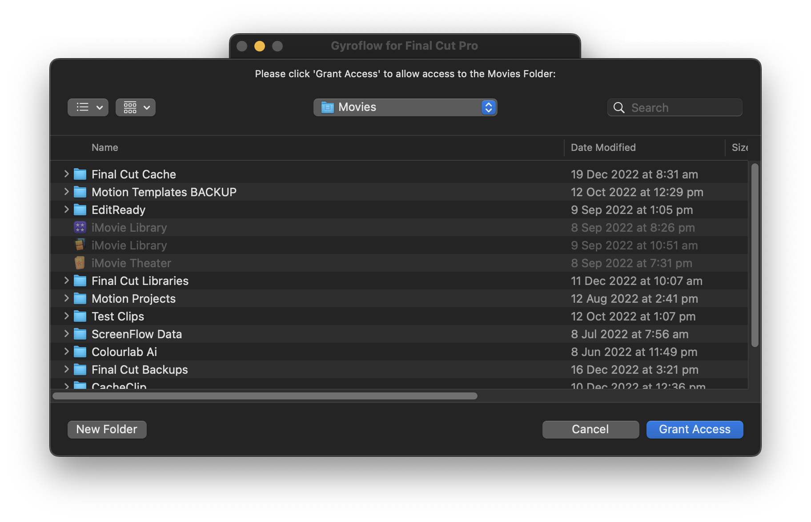
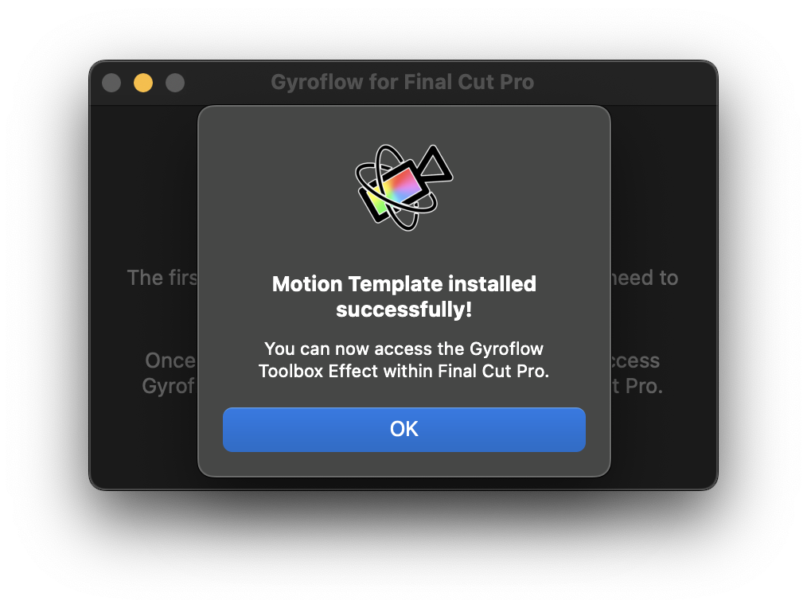
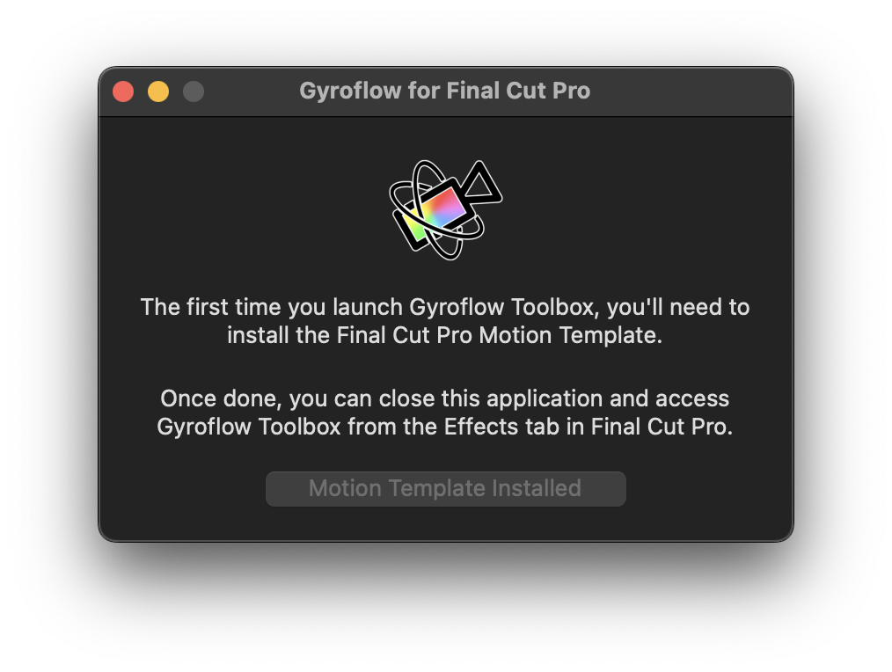
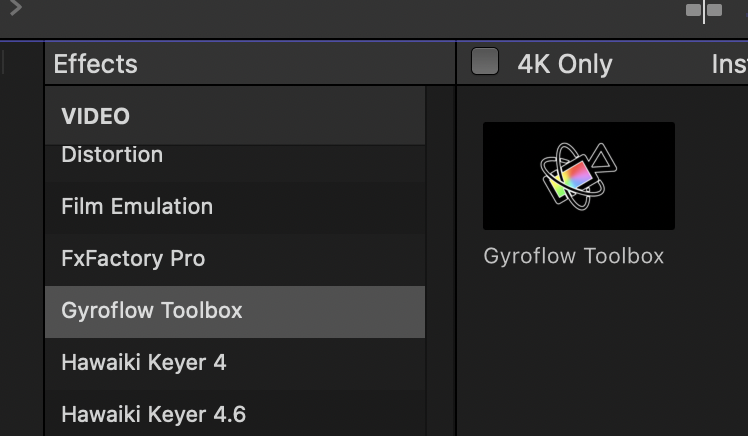
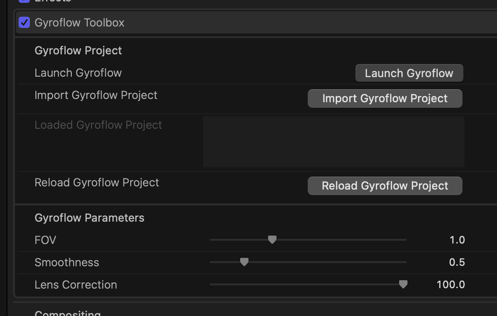
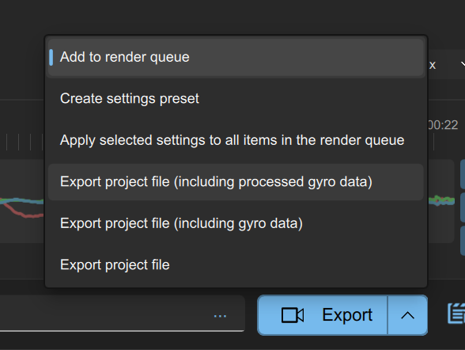

# Gyroflow Toolbox

Allows you to import [Gyroflow](https://github.com/gyroflow/gyroflow) Projects into Apple's [Final Cut Pro](https://www.apple.com/final-cut-pro/).

## What is Gyroflow?

[Gyroflow](https://github.com/gyroflow/gyroflow) is a free and open source application that can stabilize your video by using motion data from a gyroscope and optionally an accelerometer. Modern cameras record that data internally (GoPro, Sony, Insta360 etc), and Gyroflow stabilizes the captured footage precisely by using them. It can also use gyro data from an external source (eg. from Betaflight blackbox).

Gyroflow Toolbox allows you to take the stabilised data from Gyroflow and use it within Final Cut Pro as an effect.

You will need to install the latest [Gyroflow](https://gyroflow.xyz/download) application, before using Gyroflow Toolbox.

## Limitations

- Due to limitations in Final Cut Pro's FxPlug4 API - we currently can't determine the source start timecode of a clip. Because of this, the Gyroflow Toolbox effect should only be applied to a clip where the start of the clip hasn't been trimmed in the timeline (i.e. the clip you have in the timeline should show the first frame of the source clip). If you need to trim the start of this clip, you can use the full clip within a Compound Clip, then trim the Compound Clip as required. We have been in contact with the Final Cut Pro team about this, and there's currently no other workaround or solution. Discussed in [issue 8](https://github.com/latenitefilms/GyroflowToolbox/issues/8).

## Test Footage

The Gyroflow team have kindly shared some test footage that contains gyro data on [Google Drive](https://drive.google.com/drive/folders/1sbZiLN5-sv_sGul1E_DUOluB5OMHfySh?usp=sharing).

## Supported Gyro Sources

You can find a list of all the current supported gyro sources on the [Gyroflow Repository](https://github.com/gyroflow/gyroflow#supported-gyro-sources).

- GoPro (HERO 5 and later)
- Sony (a1, a7c, a7r IV, a7 IV, a7s III, a9 II, FX3, FX6, FX9, RX0 II, RX100 VII, ZV1, ZV-E10)
- Insta360 (OneR, OneRS, SMO 4k, Go, GO2, Caddx Peanut)
- DJI (Avata, O3 Air Unit)
- Blackmagic RAW (*.braw)
- RED RAW (*.r3d)
- Betaflight blackbox (*.bfl, *.bbl, *.csv)
- ArduPilot logs (*.bin, *.log)
- Gyroflow [.gcsv log](https://docs.gyroflow.xyz/logging/gcsv/)
- iOS apps: [`Sensor Logger`](https://apps.apple.com/us/app/sensor-logger/id1531582925), [`G-Field Recorder`](https://apps.apple.com/at/app/g-field-recorder/id1154585693), [`Gyro`](https://apps.apple.com/us/app/gyro-record-device-motion-data/id1161532981), [`GyroCam`](https://apps.apple.com/us/app/gyrocam-professional-camera/id1614296781)
- Android apps: [`Sensor Logger`](https://play.google.com/store/apps/details?id=com.kelvin.sensorapp&hl=de_AT&gl=US), [`Sensor Record`](https://play.google.com/store/apps/details?id=de.martingolpashin.sensor_record), [`OpenCamera Sensors`](https://github.com/MobileRoboticsSkoltech/OpenCamera-Sensors), [`MotionCam Pro`](https://play.google.com/store/apps/details?id=com.motioncam.pro)
- Runcam CSV (Runcam 5 Orange, iFlight GOCam GR, Runcam Thumb, Mobius Maxi 4K)
- Hawkeye Firefly X Lite CSV
- WitMotion (WT901SDCL binary and *.txt)
- Vuze (VuzeXR)
- KanDao (Obisidian Pro)

## Installation

You can download the latest Gyroflow Toolbox release [here](https://github.com/latenitefilms/GyroflowToolbox/releases/latest).

Download the top ZIP file, then when you extract it, drag the `Gyroflow Toolbox.app` application to your Applications folder.

You should then run the application. If it's the first time installing the software, or if there's been an update, you'll be prompted to **Install Motion Template**.

Once you click the button, you'll be prompted to grant permission to your Movies folder. This is due to macOS's sandboxing. Click **OK**.

You then need to click **Grant Access**:

Once done, you'll be presented with a successful message:

The button will now be disabled, and will say **Motion Template Installed**. You can now close the Gyroflow Toolbox application.

## How To Use

After you have installed Gyroflow and Gyroflow Toolbox, you'll see a Gyroflow Toolbox Effect in the Effects Browser.

You can then apply this effect to any clips that are supported by Gyroflow.

From the Inspector you can then click **Launch Gyroflow**, to open the Gyroflow application.

You can learn more about Gyroflow [here](https://docs.gyroflow.xyz).

Once you have finished stabilising in Gyroflow you should click the **Export** button arrow and then **Export project file (including processed gyro data)**.

It's important that you include the processed gyro data, otherwise none of the stabilisation will come across to Gyroflow Toolbox.

You can now press the **Import Project** button in the Final Cut Pro Inspector to import it.

The data from the Gyroflow Project gets saved within the Final Cut Pro library. If you want to reload it, you can either re-import, or if the file is in the same path, you can press **Reload Project**.

You can adjust and keyframe the FOV, Smoothness and Lens Correction within Final Cut Pro.

## Help & Support

For general support and discussion, you can find the Gyroflow developers and other users on the [Gyroflow Discord server](https://discord.gg/BBJ2UVAr2D).

For bug reports and feature requests for Gyroflow Toolbox, please [submit an issue](https://github.com/latenitefilms/GyroflowToolbox/issues).

## Credits

This repository was thrown together by [Chris Hocking](https://github.com/latenitefilms).

However, none of this would be possible without the incredible [Gyroflow](https://github.com/gyroflow/gyroflow) project and the incredibly help and support from their main developer, [AdrianEddy](https://github.com/AdrianEddy).

## License

All the code within **this repository** is licensed under [MIT](LICENSE.md).

**However**, as soon as you build/compile the Rust code, it uses [`gyroflow_core`](https://github.com/gyroflow/gyroflow/tree/master/src/core) as a dependancy, which uses the [GNU General Public License v3.0](https://github.com/gyroflow/gyroflow/blob/master/LICENSE).

This means that as soon as you build/compile Gyroflow Toolbox, the application falls under the same [GNU General Public License v3.0](https://github.com/gyroflow/gyroflow/blob/master/LICENSE). Because of this, all [Releases](https://github.com/latenitefilms/GyroflowToolbox/releases) in this repository also fall under the same [GNU General Public License v3.0](https://github.com/gyroflow/gyroflow/blob/master/LICENSE).