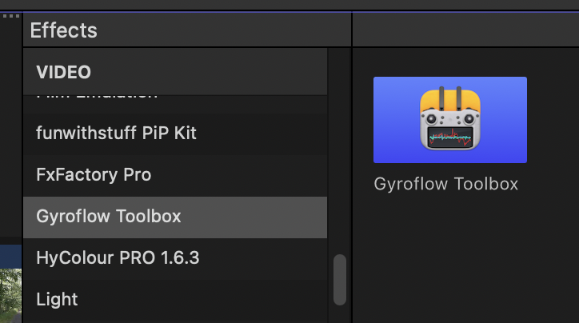
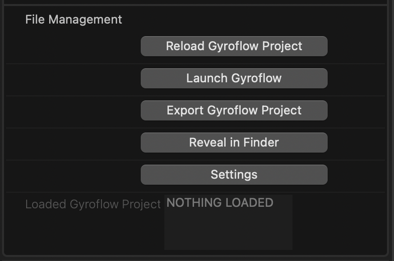

# How To Use

### What is Gyroflow?

[Gyroflow](https://github.com/gyroflow/gyroflow) is a free and open source third-party application that can stabilise your video by using motion data from a gyroscope and optionally an accelerometer. Modern cameras record that data internally (such as Blackmagic, GoPro, Sony, Insta360 etc), and Gyroflow stabilises the captured footage precisely by using that data. It can also use gyro data from an external source, such as Betaflight Blackbox.

**Gyroflow Toolbox** allows you to take the stabilised data from Gyroflow and use it within Final Cut Pro as an effect, so you don't have to export a ProRes from Gyroflow!

It's important to understand that **Gyroflow** and **Gyroflow Toolbox** are independent/seperate applications, that share the same render engine - [Gyroflow Core](https://docs.gyroflow.xyz/app/technical-details/gyroflow-core).

---

### Learning Gyroflow

Gyroflow has [fantastic documentation](https://docs.gyroflow.xyz/app/) that is regularly updated.

The [Gyroflow Discord](https://discord.gg/BBJ2UVAr2D) is also very active and a great way to get fast support from some of the best and nicest people in the industry.

There are also some great YouTube Videos around, such as:

---

### Prerequisites

To create the Gyroflow Project (that you import into Gyroflow Toolbox), you'll need to install the latest [Gyroflow](https://gyroflow.xyz/download) application.

However, you don't necessarily have to install **Gyroflow** on the same machine as **Gyroflow Toolbox** - for example, you could run Gyroflow on a fast PC, then copy the exported Gyroflow Project to your Mac to import into Gyroflow Toolbox.

There are also some formats, such as **GoPro**, **DJI**, **Insta360** (and even some **Sony** clips) that don't require launching Gyroflow at all, and you can stay completely within Final Cut Pro.

---

### Limitations

_**You should always put the Gyroflow Toolbox effect on a clip INSIDE a Compound Clip with EXACTLY the same FRAME RATE and RESOLUTION.**_

This is because you should only ever apply the Gyroflow Toolbox effect to an **entire clip** - the clip cannot be trimmed. Due to limitations in Final Cut Pro's FxPlug4 API - we currently can't determine the source start timecode of a clip. Because of this, the Gyroflow Toolbox effect should only be applied to a clip where the start of the clip hasn't been trimmed in the timeline (i.e. the clip you have in the timeline should show the first frame of the source clip). If you need to trim the start of this clip, you can use the full clip within a Compound Clip, then trim the Compound Clip as required.

We have been in contact with the Final Cut Pro team about this, and there's currently no other better workaround or solution. This is discussed [on GitHub](https://github.com/latenitefilms/GyroflowToolbox/issues/8) and we would appreciate it if you could let Apple know this is something you'd like to see addressed. You can reference our Apple Feedback Assistant ID: **FB12043900**.

---

### Test Footage

The Gyroflow team have kindly shared some test footage that contains gyro data on [Google Drive](https://drive.google.com/drive/folders/1sbZiLN5-sv_sGul1E_DUOluB5OMHfySh?usp=sharing).

---

### Supported Gyro Sources

You can find a list of all the currently supported gyro sources in the [Gyroflow Documentation](https://docs.gyroflow.xyz/app/getting-started/supported-cameras).

This includes:

- GoPro (HERO 5 and later)
- Sony (a1, a7c, a7r IV, a7 IV, a7s III, a9 II, FX3, FX6, FX9, RX0 II, RX100 VII, ZV1, ZV-E10)
- Insta360 (OneR, OneRS, SMO 4k, Go, GO2, Caddx Peanut)
- DJI (Avata, O3 Air Unit)
- Blackmagic RAW (*.braw)
- RED RAW (*.r3d)
- Betaflight blackbox (*.bfl, *.bbl, *.csv)
- ArduPilot logs (*.bin, *.log)
- Gyroflow [.gcsv log](https://docs.gyroflow.xyz/logging/gcsv/)
- iOS apps: [`Sensor Logger`](https://apps.apple.com/us/app/sensor-logger/id1531582925), [`G-Field Recorder`](https://apps.apple.com/at/app/g-field-recorder/id1154585693), [`Gyro`](https://apps.apple.com/us/app/gyro-record-device-motion-data/id1161532981), [`GyroCam`](https://apps.apple.com/us/app/gyrocam-professional-camera/id1614296781)
- Android apps: [`Sensor Logger`](https://play.google.com/store/apps/details?id=com.kelvin.sensorapp&hl=de_AT&gl=US), [`Sensor Record`](https://play.google.com/store/apps/details?id=de.martingolpashin.sensor_record), [`OpenCamera Sensors`](https://github.com/MobileRoboticsSkoltech/OpenCamera-Sensors), [`MotionCam Pro`](https://play.google.com/store/apps/details?id=com.motioncam.pro)
- Runcam CSV (Runcam 5 Orange, iFlight GOCam GR, Runcam Thumb, Mobius Maxi 4K)
- Hawkeye Firefly X Lite CSV
- WitMotion (WT901SDCL binary and *.txt)
- Vuze (VuzeXR)
- KanDao (Obisidian Pro)

---

### How To Use

If you haven't already, follow the installation instructions [here](/installation/) first.

After you have installed [Gyroflow](https://gyroflow.xyz/download) and Gyroflow Toolbox, you'll see a Gyroflow Toolbox Effect in the Effects Browser:

You can then apply this effect to any clips that are supported by Gyroflow.

---

### Applying the Effect

You should always put the Gyroflow Toolbox effect on a clip INSIDE a Compound Clip (see [limitations above](#limitations)) with the EXACT same RESOLUTION and FRAME RATE.

It will then look like this:

---

### Importing Gyroflow Project

If you have a pre-existing Gyroflow Project, there's a few different ways you can import a Gyroflow Project:

- Drag & Drop from Finder
- Drag & Drop from another application (such as an Asset Management Tool)
- Press the **Import Gyroflow Project**
- Press the **Import Last Gyroflow Project**

If you have a Gyroflow Project with the same filename sitting next to the Media File, Gyroflow Toolbox will always try and load that Gyroflow Project.

---

### Importing Media File

If you don't already have a Gyroflow Project for a media file, there's a few different ways you can import a media file:

- Drag & Drop from Final Cut Pro Browser
- Drag & Drop from another application (such as an Asset Management Tool)
- Drag & Drop from Finder
- Press the **Import Media File** button

If you drag-and-drop from the Final Cut Pro Browser you will be prompted to select the video file you imported (due to macOS's sandboxing).

If there's a Gyroflow Project next to the Media File with the exact same filename, Gyroflow Toolbox will try to load that file instead.

GoPro, DJI, Insta360 and some Sony files will automatically synchronise (as the gyroscope data is within the media file), so then you'll be presented with:

If the Media File requires synchronising in the hero Gyroflow application, Gyroflow Toolbox will launch the Media File in Gyroflow.

If the Media File requires manually loading a **Lens Profile**, Gyroflow Toolbox will prompt to allow you to select a Lens Profile from the built-in collection within Gyroflow.

---

### Gyroflow Parameters

Once you've imported a Media File or Gyroflow Project you can then use the Gyroflow Parameters to customise things.

All of the parameters are keyframe-able, however...

_**Any keyframes created in Gyroflow will take priority over the keyframes in Final Cut Pro.**_

**Input Rotation** is when Final Cut Pro rotates the input pixels before feeding to Gyroflow Toolbox.

For example, if an `.mp4` contains rotation in the metadata, Final Cut Pro may automatically rotate it. Gyroflow expects raw pixels directly from the source file, so if Final Cut Pro has already rotated them, it won't match.

Given this, the **Input Rotation** is the rotation done by the host BEFORE feeding to Gyroflow Toolbox, whereas **Video Rotation** is a rotation by the Gyroflow engine AFTER stabilisation.

---

### Tools

There are also some handy tools:

#### Stabilisation Overview

This allow you to zoom out the view to see the stabilization results. This is very useful to see if and how Gyroflow is working. You should disable this before rendering.

#### Disable Gyroflow Stretch

If you used Input stretch in the lens profile in Gyroflow, and you de-stretched the video separately in Resolve, check this to disable Gyroflow's internal stretching.

---

### File Management

At the bottom of the Effect is in the Inspector is some File Management tools:

**Reload Gyroflow Project** allows you to reload the contents of a Gyroflow Project if you've modified it externally (i.e. in the Gyroflow application).

**Launch Gyroflow** is handy for opening the hero Gyroflow application. If you have a Gyroflow Project or Media File already loaded, it will open that file.

**Export Gyroflow Project** is handy if you imported a GoPro, DJI or Insta360 clip (that didn't require synchronising in the hero Gyroflow application), and you need to export a Gyroflow Project for sharing or editing.

**Reveal in Finder** reveals the Gyroflow Project in Finder.

**Settings** allows you to enable/disable some of the helper alerts/popups throughout the application, **Show Log Files in Finder**, and **Reset All Settings** (which is only really used for debugging/development).