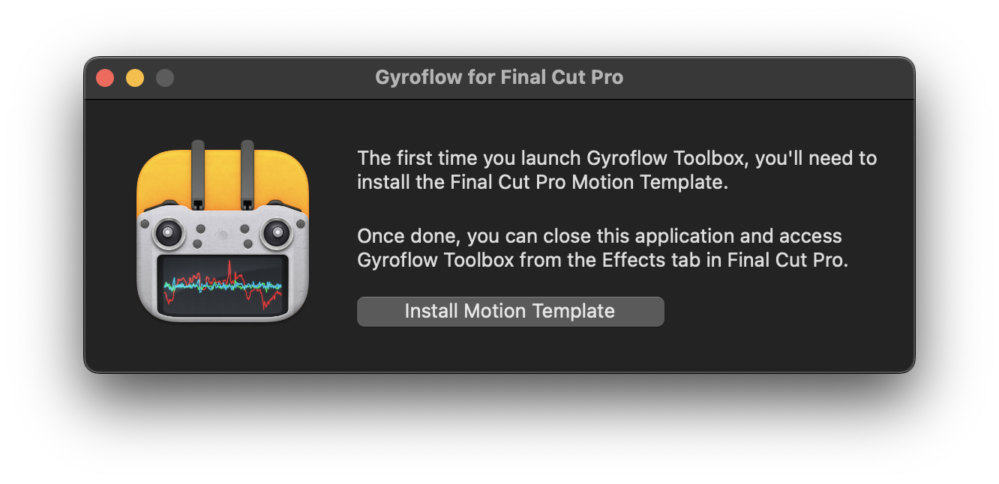
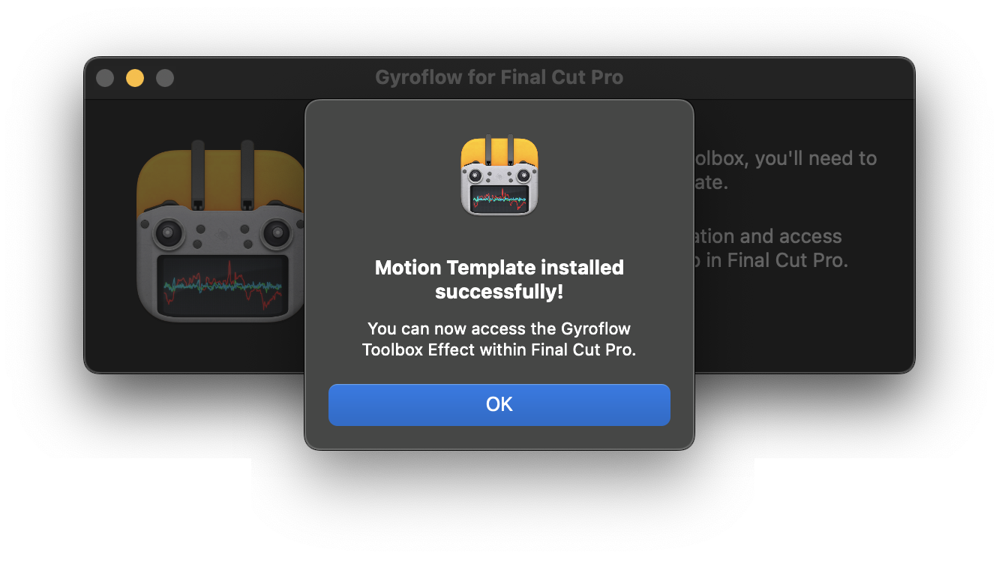
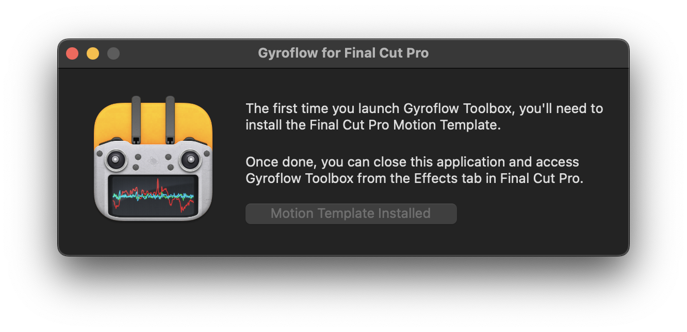

# Installation

**Gyroflow Toolbox** allows you to take the stabilised data from **Gyroflow** and use it within **Final Cut Pro** as an effect.

You can purchase the latest Gyroflow Toolbox release on the [Mac App Store](https://apps.apple.com/au/app/gyroflow-toolbox/id1667462993?mt=12).

You can download the latest **Gyroflow** release for free from the [Gyroflow website](https://gyroflow.xyz/download).

Please install the latest **Gyroflow** first. You can learn more about installing Gyroflow [here](https://docs.gyroflow.xyz/app/getting-started/installation).

---

### Installing Gyroflow Toolbox

If it's the first time installing the software, or if there's been an update, you'll be prompted to **Install Motion Template**.

Once you click the button, you'll be prompted to grant permission to your Movies folder. This is due to macOS's sandboxing, and you'll only need to do this once. Click **OK**.

You then need to click **Grant Access**:

Once done, you'll be presented with a successful message:

The button will now be disabled, and will say **Motion Template Installed**. You can now close the Gyroflow Toolbox application.

Now that you have **Gyroflow Toolbox** installed, you can learn [how to use it](/how-to-use/).